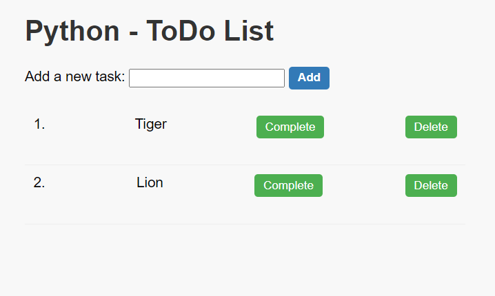

# ToDo List Web Application

This is a simple ToDo list web application built with Flask (Python web framework).



## Getting Started

### Prerequisites

- Python (3.x recommended)
- Flask

### Installing Dependencies

Install Flask:

```bash
pip install flask
```

### Running the Application

1. Clone the repository:

```bash
git clone <repo-link>
```

2. Navigate to the project directory:

```bash
cd my-todo-app
```

3. Run the Flask application:

```bash
python app.py
```

4. Open your web browser and go to [http://localhost:5000](http://localhost:5000) to use the ToDo list app.

## Project Structure

- **/app.py**: Main file containing the Flask application.
- **templates/index.html**: HTML template for rendering the ToDo list.
- **static/style.css**: CSS file for styling the application.
- **todo/**init**.py**: Empty file to make the `todo` directory a Python package.
- **todo/tasks.py**: Module containing functions to manage tasks in memory.

## Contributing

Feel free to contribute to this project by opening issues or submitting pull requests.

## License

This project is licensed under the MIT License - see the [LICENSE](LICENSE) file for details.
